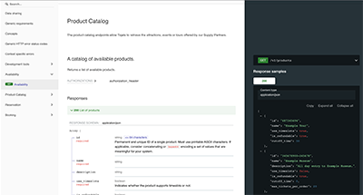

# Tiqets Supplier API

The Tiqets Supplier API Specification allows Tour Operators and Venues to sell their tickets on [Tiqets.com](https://www.tiqets.com/).

Take control and get connected.

Refer to [https://www.tiqets.com/venues](https://www.tiqets.com/venues) for more information on how or why you should become a supplier.

## API Documentation

Our [online documentation](https://tiqets.github.io/supplier-api/) (OpenAPI / Swagger) details what interfaces you need to add to your servers and [how to test](https://tiqets.github.io/supplier-api/#section/Development-tools) your implementation.

