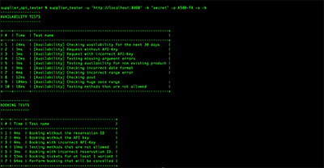

# Supplier API Testing Tool



## Requirements

Python 3.7+

## Installation

```sh
pip install supplier-api-tester
```

## Usage

The CLI Testing Tool supports both API v1.x and v2.x. By default, the CLI runs all the tests for API v2.x. 

If you wish to test your API implementation based on the v1 specification then you can pass the argument `--version` 
(or `-v`) in the CLI to enable v1 testing.

For more details on how to test your v1-complaint implementation please refer to the [API docs for V1](https://tiqets.github.io/supplier-api/v1.html). 

For example, the following command will test your API implementation according to the v1 specification:

```sh
supplier_products -u 'http://localhost:8000' -k 'secret' -v 1
```

Listing the products catalog:

```sh
supplier_products -u 'http://localhost:8000' -k 'secret' -v 2
+---------+---------+-----------+------------+-------------+-------------------------------------------+-----------------------------------+-----------------------------------+
| ID      | Name    | Timeslots | Refundable | Cutoff time | Required Additional Order Data            | Required Additional Visitors Data | Provides Pricing                  |
+---------+---------+-----------+------------+-------------+-------------------------------------------+-----------------------------------+-----------------------------------+
| A300-FX | A300-FX | True      | True       | 24          |                                           |                                   | True                              |
| A400-FX | A400-FX | True      | False      | 0           | pickup_location,passport_id               | full_name,phone                   | False                             |
| A500-FX | A500-FX | False     | True       | 0           | pickup_location,passport_id,flight_number |                                   | True                              |
| A550-FX | A550-FX | False     | True       | 10          |                                           | email,date_of_birth               | False                             |
| A600-FX | A600-FX | False     | False      | 0           | nationality                               |                                   | False                             |
+---------+---------+-----------+------------+-------------+-------------------------------------------+-----------------------------------+-----------------------------------+
```

Listing the products catalog for API v1.x:

```shell
supplier_products -u 'http://localhost:8000' -k 'secret' -v 1
+---------+---------+-----------+------------+-------------+
| ID      | Name    | Timeslots | Refundable | Cutoff time |
+---------+---------+-----------+------------+-------------+
| A300-FX | A300-FX | True      | True       | 24          |
| A400-FX | A400-FX | True      | False      | 0           |
| A500-FX | A500-FX | False     | True       | 0           |
| A550-FX | A550-FX | False     | True       | 10          |
| A600-FX | A600-FX | False     | False      | 0           |
+---------+---------+-----------+------------+-------------+
```

Testing tool usage:
```
supplier_tester --help
Usage: supplier_tester [OPTIONS]

  Test your Supplier API implementation

Options:
  -u, --url TEXT         [required]
  -k, --api-key TEXT     [required]
  -p, --product-id TEXT  Product ID to call tests on. Required with -a and -t flags
  -t, --timeslots        Use timeslots
  -a, --availability     Run availability tests
  -r, --reservation      Run reservation tests
  -b, --booking          Run booking tests
  -c, --catalog          Run product catalog tests
  -nc, --no-colors       Not using colors on output
  -v, --version          Choosing the API version
  --help                 Show this message and exit
```

Running all tests:

```sh
supplier_tester -u 'http://localhost:8000' -k 'secret' -p 'A500-FX' -v 2
```

Running only availability tests:

```sh
supplier_tester -u 'http://localhost:8000' -k 'secret' -p 'A500-FX' -a -v 2
```

Test example:

```sh
supplier_tester -u 'http://localhost:8000' -k 'secret' -p 'A500-FX' -v 2

------------------
AVAILABILITY TESTS
------------------

+----+-------+---------------------------------------------------+
| #  | Time  | Test name                                         |
+----+-------+---------------------------------------------------+
| 1  | 28ms  | Checking availability for the next 30 days        |
| 2  | 4ms   | Request without API-Key                           |
| 3  | 9ms   | Request with incorrect API-Key                    |
| 4  | 23ms  | Testing missing argument errors                   |
| 5  | 8ms   | Testing availability for non existing product     |
| 6  | 19ms  | Checking incorrect date format                    |
| 7  | 8ms   | Checking incorrect range error                    |
| 8  | 8ms   | Checking past date                                |
| 9  | 112ms | Checking huge date range                          |
| 10 | 23ms  | Testing methods that are not allowed              |
| 11 | 13ms  | Testing optional price attribute in availability  |
+----+-------+---------------------------------------------------+

-----------------
RESERVATION TESTS
-----------------

+---+------+-----------------------------------------------------------+
| # | Time | Test name                                                 |
+---+------+-----------------------------------------------------------+
| 1 | 5ms  | Request without API-Key                                   |
| 2 | 6ms  | Request with incorrect API-Key                            |
| 3 | 33ms | Testing missing argument errors                           |
| 4 | 29ms | Reserving tickets for at least 1 variant                  |
| 5 | 30ms | Testing reservation for non-existing product              |
| 6 | 47ms | Testing reservation with incorrect date format            |
| 7 | 21ms | Testing reservation with past date                        |
| 8 | 34ms | Testing methods that are not allowed                      |
| 9 | 50ms | Testing reservation for product with provide_pricing=True |
+---+------+-----------------------------------------------------------+

-------------
BOOKING TESTS
-------------

+---+------+----------------------------------------+
| # | Time | Test name                              |
+---+------+----------------------------------------+
| 1 | 3ms  | Booking without the reservation ID     |
| 2 | 3ms  | Booking without the API key            |
| 3 | 3ms  | Booking with incorrect API-Key         |
| 4 | 15ms | Testing methods that are not allowed   |
| 5 | 6ms  | Booking with incorrect reservation ID. |
| 6 | 29ms | Booking tickets for at least 1 variant |
| 7 | 72ms | Perform booking that will be cancelled |
+---+------+----------------------------------------+

---------------
PRODUCT CATALOG
---------------

+---+------+---------------------+
| # | Time | Test name           |
+---+------+---------------------+
| 1 | 7ms  | Get product catalog |
+---+------+---------------------+
```
