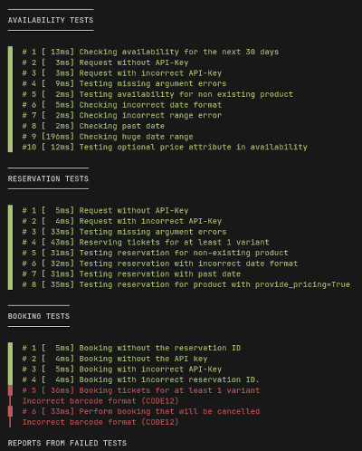

# Supplier API Testing Tool



## Requirements

Python 3.7+

## Installation

```sh
pip install supplier-api-tester
```

## Usage

The CLI Testing Tool supports both API v1.x and v2.x. By default, the CLI runs all the tests for API v2.x. 

If you wish to test your API implementation based on the v1 specification then you can pass the argument `--version-1` 
(`-v1`) in the CLI to enable v1 testing.

For example, the following command will test your API implementation according to the v1 specification:

```sh
supplier_products -u 'http://localhost:8000' -k 'secret' --version-1
```

**Important: remember to run the appropriate version of the API server if you are testing both versions at the same 
time**

Listing the products catalog:

```sh
supplier_products -u 'http://localhost:8000' -k 'secret'
+---------+---------+-----------+------------+-------------+-------------------------------------------+-----------------------------------+
| ID      | Name    | Timeslots | Refundable | Cutoff time | Required Additional Order Data            | Required Additional Visitors Data |
+---------+---------+-----------+------------+-------------+-------------------------------------------+-----------------------------------+
| A300-FX | A300-FX | True      | True       | 24          |                                           |                                   |
| A400-FX | A400-FX | True      | False      | 0           | PICKUP_LOCATION,PASSPORT_ID               | FULL_NAME,PHONE                   |
| A500-FX | A500-FX | False     | True       | 0           | PICKUP_LOCATION,PASSPORT_ID,FLIGHT_NUMBER |                                   |
| A550-FX | A550-FX | False     | True       | 10          |                                           | EMAIL,DATE_OF_BIRTH               |
| A600-FX | A600-FX | False     | False      | 0           | NATIONALITY                               |                                   |
+---------+---------+-----------+------------+-------------+-------------------------------------------+-----------------------------------+
```

Listing the products catalog for API v1.x:

```shell
supplier_products -u 'http://localhost:8000' -k 'secret' --version-1
+---------+---------+-----------+------------+-------------+
| ID      | Name    | Timeslots | Refundable | Cutoff time |
+---------+---------+-----------+------------+-------------+
| A300-FX | A300-FX | True      | True       | 24          |
| A400-FX | A400-FX | True      | False      | 0           |
| A500-FX | A500-FX | False     | True       | 0           |
| A550-FX | A550-FX | False     | True       | 10          |
| A600-FX | A600-FX | False     | False      | 0           |
+---------+---------+-----------+------------+-------------+
```

Testing tool usage:
```
supplier_tester --help
Usage: supplier_tester [OPTIONS]

  Test your Supplier API implementation

Options:
  -u, --url TEXT         [required]
  -k, --api-key TEXT     [required]
  -p, --product-id TEXT  Product ID to call tests on. Required with -a and -t flags
  -t, --timeslots        Use timeslots
  -a, --availability     Run availability tests
  -r, --reservation      Run reservation tests
  -b, --booking          Run booking tests
  -c, --catalog          Run product catalog tests
  -nc, --no-colors       Not using colors on output
  -v1, --version-1       Run the CLI tests for API v1.x
  --help                 Show this message and exit
```

Running all tests:

```sh
supplier_tester -u 'http://localhost:8000' -k 'secret' -p 'A500-FX'  # For products without timeslots
supplier_tester -u 'http://localhost:8000' -k 'secret' -p 'A400-FX' -t  # For products with timeslots
```

**Remember to choose valid product id. It has to refer timeslotted product when you use `-t` flag.**

Running only availability tests:

```sh
supplier_tester -u 'http://localhost:8000' -k 'secret' -p 'A500-FX' -a  # For products without timeslots
supplier_tester -u 'http://localhost:8000' -k 'secret' -p 'A400-FX' -a -t  # For products with timeslots
```

Test example:

```sh
supplier_tester -u 'http://localhost:8000' -k 'secret' -p 'A500-FX'

------------------
AVAILABILITY TESTS
------------------

+----+-------+--------------------------------------------------------------+
| #  | Time  | Test name                                                    |
+----+-------+--------------------------------------------------------------+
| 1  | 24ms  | [Availability] Checking availability for the next 30 days    |
| 2  | 3ms   | [Availability] Request without API-Key                       |
| 3  | 3ms   | [Availability] Request with incorrect API-Key                |
| 4  | 13ms  | [Availability] Testing missing argument errors               |
| 5  | 5ms   | [Availability] Testing availability for non existing product |
| 6  | 10ms  | [Availability] Checking incorrect date format                |
| 7  | 5ms   | [Availability] Checking incorrect range error                |
| 8  | 5ms   | [Availability] Checking past date                            |
| 9  | 117ms | [Availability] Checking huge date range                      |
| 10 | 34ms  | [Availability] Testing methods that are not allowed          |
+----+-------+--------------------------------------------------------------+

-----------------
RESERVATION TESTS
-----------------

+---+------+------------------------------------------------+
| # | Time | Test name                                      |
+---+------+------------------------------------------------+
| 1 | 3ms  | Request without API-Key                        |
| 2 | 4ms  | Request with incorrect API-Key                 |
| 3 | 21ms | Testing missing argument errors                |
| 4 | 3ms  | Reserving tickets for at least 1 variant       |
| 5 | 4ms  | Testing reservation for non-existing product   |
| 6 | 4ms  | Testing reservation with incorrect date format |
| 7 | 3ms  | Testing reservation with past date             |
| 8 | 13ms | Testing methods that are not allowed           |
+---+------+------------------------------------------------+

-------------
BOOKING TESTS
-------------

+---+------+----------------------------------------+
| # | Time | Test name                              |
+---+------+----------------------------------------+
| 1 | 4ms  | Booking without the reservation ID     |
| 2 | 2ms  | Booking without the API key            |
| 3 | 4ms  | Booking with incorrect API-Key         |
| 4 | 13ms | Testing methods that are not allowed   |
| 5 | 3ms  | Booking with incorrect reservation ID. |
| 6 | 7ms  | Booking tickets for at least 1 variant |
| 7 | 21ms | Perform booking that will be cancelled |
+---+------+----------------------------------------+

---------------
PRODUCT CATALOG
---------------

+---+------+-----------------------------------------------------------+
| # | Time | Test name                                                 |
+---+------+-----------------------------------------------------------+
| 1 | 4ms  | Get product catalog                                       |
+---+------+-----------------------------------------------------------+
```
