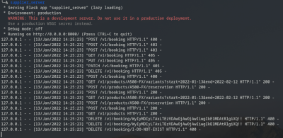

# Supplier API mock server

Mock server on which you can test the [Supplier API](https://tiqets.github.io/supplier-api/) implementation.



## Requirements

Python 3.7+

## Installation

```sh
pip install supplier-api-mock-server
```

## Running

```sh
supplier_server
```

## Running with docker

```sh
make image
make run
```

## Example request

```
curl -H "API-Key: secret" http://localhost:8000/v1/products
```
